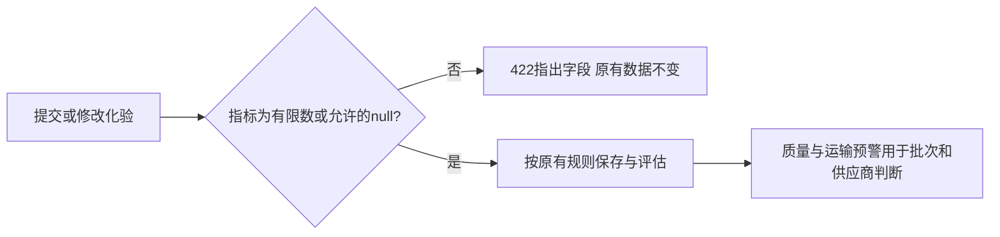

# 化验输入的有限数校验与面试案例

## 业务问题

煤质记录的低位/高位热值、灰分、硫分、全水分、分析水分、挥发分和固定碳需要能参与数值比较。旧创建和修改接口接受NaN、正负无穷及溢出为无穷的指数输入，返回200并写入数据库。NaN可使比较条件失效，Infinity可让正常化验比对得到错误结论或产生无效计算数据。

本轮通过真实HTTP路由、JWT和临时SQLite复现。创建入厂化验及修改已有化验都受影响；必须在业务写入前拒绝异常，保护已有批次、预警、处理历史和评分记录。

## 当前行为与兼容

- 创建/修改的8项指标统一使用有限数类型；NaN、正负Infinity和溢出输入返回422，指出具体字段。
- 合法JSON数字`1e309`会被Python解析为浮点无穷。先将这个异常值转为可序列化的文本，再交给有限数校验；它仍被拒绝，错误详情能正常返回422。没有改全局错误处理器。
- 省略字段、显式null、零及现有有限数值字符串转换保持兼容。修改时省略字段保留原值，显式null保留原有清空语义。
- 正常有限值仍参与质量评估；低位热值6000→5800及灰分15→16的模拟场景继续产生质量预警，并保留运输铅封预警及处理记录。
- 没有接口字段、迁移、前端源码、依赖文件或质量阈值变化。有限数校验不规定化验单位、基准或物理上下限；这些规则需要后续业务核对。



## 可复跑证据

按[开发与验收](MAINTENANCE.md)安装依赖，在仓库根目录执行：

```sh
cd backend
python -m pytest tests/test_lab_finite_values.py -q
python -m pytest tests -q
```

完整后端110项通过，新增75项包含其中：48项覆盖8指标×创建/修改×3类非有限字符串；18项覆盖指数溢出的字符串和JSON数字；9项覆盖有限值/零/字符串、缺省/null、正常预警及鉴权。每项拒绝回归比较真实数据库全部字段及API结果，包含另一批次、已处理运输预警和供应商评分。

正式先失败验证为52 failed/9 passed，全部52项因旧接口返回200。仅加有限数约束后，JSON数字溢出的错误详情仍造成500；扩展到8指标/双入口确认16 failed/59 passed。最终完整110 passed、0 failed/skipped。TypeScript/Vite、Ruff致命错误检查、pip与diff检查通过。1390条本地警告（含弃用及测试收集警告）及已有2394.64kB包警告保留。

测试使用临时数据库、真实JWT角色与集成密钥；没有启动默认应用lifespan或操作默认演示库。测试数包含参数矩阵，不等于75种独立业务能力。

## 内部招聘讲解卡

先讲业务：模拟化验录入出现异常数值，如果直接进入偏差判断，可能把数据异常解释成无预警。质量判断和供应商评价应基于有效输入，异常录入要能指出字段，并保留原有记录供核对。

再讲判断：沿“HTTP输入→请求类型→数据库保存→自动评估”定位根因，在创建和修改的共同数值边界校验。遇到JSON数字溢出，还要验证错误响应本身，避免校验发现了错误却只给调用方500。对null与省略字段保持兼容，并把单位/物理范围留待实际规则核对。

最后讲证据：先看到真实失败，再完成修复；用数据库全字段快照验证拒绝后不变，用正常热值/灰分偏差和已有运输处理记录证明业务评估仍能运行。可选择`test_each_metric_rejects_nonfinite_values_without_side_effects`、`test_json_exponent_overflow_has_serializable_rejection_for_each_metric`及`test_valid_deviation_still_alerts_and_transport_history_survives`演示。

| 面试追问 | 回答重点 |
|---|---|
| 对电厂业务有什么意义？ | 异常化验输入可被定位并要求核对，既有质量预警和运输处理证据不会被失败修改破坏。 |
| 为什么创建和修改都校验？ | 只保护新录入，旧记录仍可被修改入口污染，两条写入口都需要验证。 |
| 为何null仍允许？ | 现有接口允许指标未提供或清空；完整性和单位规则应按化验业务另行明确。 |
| 数字1e309为何出问题？ | JSON能表达该指数，当前浮点表示会溢出；错误详情也必须能序列化，才能返回明确的422。 |
| 测试通过能证明什么？ | 证明覆盖输入、拒绝后数据保护和正常模拟评估；生产化验校准、并发、容量与现场验收需独立证据。 |

按本人实际理解和参与程度讲解，说明AI辅助开发；信息化岗位可展开校验与事务，生产/燃料管理岗位可侧重化验来源和异常核对。

## 后续范围

历史非有限记录需按原化验报告核对，本轮不自动改写。单位、化验基准、物理范围、缺项完整性、极端有限数的计算安全和其他接口浮点字段属于后续范围；本轮未完成生产数据修复、浏览器/PG并发验收或依赖安全扫描。
